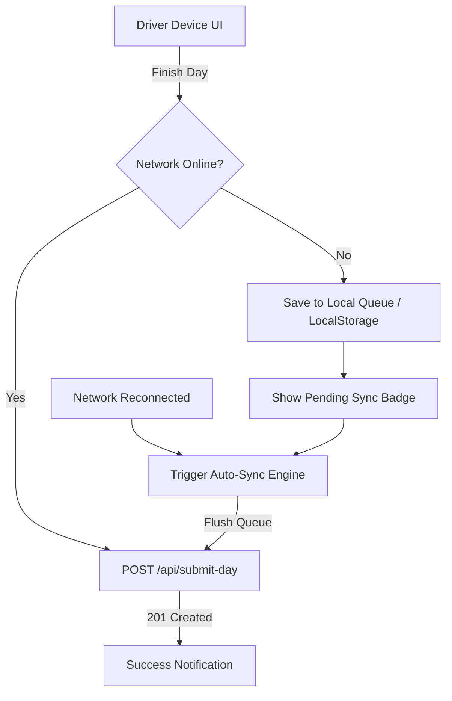

# Implementation Plan: Offline Mode & Auto-Sync Engine

This document outlines the step-by-step implementation plan for introducing **Offline Mode**, **Local Data Queueing**, **PWA Caching**, and **Automatic Syncing** to the **Driver Delivery Log** application.

---

## 🎯 Objectives
1. **Uninterrupted Driver Experience**: Allow drivers to record deliveries, sign, and finish their day even without cell service or WiFi.
2. **Zero Data Loss**: Securely store pending submissions in local browser storage until network connectivity is re-established.
3. **Automatic Re-sync**: Background sync engine that automatically pushes queued logs to the backend database once online.
4. **PWA Capability**: Cache static application assets so the web app opens instantly while offline.
5. **Clear UI Feedback**: Real-time status indicators (Online 🟢 / Offline 🟠 / Syncing ⚡) to keep the driver informed.

---

## 🏗️ System Architecture



---

## 📋 Phase Breakdown

### Phase 1: Offline Storage & Queue Helper (`src/app/lib/offlineQueue.ts`)
Create a dedicated utility module to manage local queueing, local caching, and submission persistence.

* **Tasks**:
  1. Define TypeScript interfaces for queued logs (`QueuedSubmission`):
     ```typescript
     export interface QueuedSubmission {
       id: string; // Unique UUID / timestamp key
       createdAt: string;
       payload: {
         date: string;
         driver: string;
         jobs: Array<{
           jobNumber: string;
           task: string;
           paperwork: boolean;
           location: string;
           startTime: string;
           stopTime: string;
         }>;
         arrivalBackTime: string;
       };
     }
     ```
  2. Implement queue functions:
     * `enqueueSubmission(payload)`: Save pending day payload to `localStorage`.
     * `getQueue()`: Retrieve all queued payloads.
     * `dequeueSubmission(id)`: Remove successfully synced item.
     * `cacheLocations(locations)` / `getCachedLocations()`: Offline fallback for location quick-picks.

---

### Phase 2: Network Detection Hook (`src/app/hooks/useOnlineStatus.ts`)
Create a reusable React hook to track real-time internet connectivity status.

* **Tasks**:
  1. Listen for `window.addEventListener('online')` and `window.addEventListener('offline')`.
  2. Perform periodic light ping checks (`fetch('/api/locations')`) to detect captive portals or limited connectivity.
  3. Expose `{ isOnline: boolean }` to components.

---

### Phase 3: Status Badge & UI Feedback Components
Build user-facing status indicators to communicate network and sync state clearly.

* **Tasks**:
  1. Create `SyncStatusBadge` component:
     * **Green Badge**: `🟢 Online (All synced)`
     * **Amber Badge**: `🟠 Offline (2 logs queued)`
     * **Blue/Purple Spinning**: `⚡ Syncing queued logs...`
  2. Integrate `SyncStatusBadge` into header of [App.tsx](file:///C:/Users/ItechMediaLogic/prods/DriverDeliveryLog-main/src/app/App.tsx).

---

### Phase 4: App Integration & Submission Logic (`App.tsx`)
Modify submission flow and location fetchers to support offline fallbacks.

* **Tasks**:
  1. **Location Fetching**: Update `useEffect` location load to attempt API fetch, falling back to cached local storage if network fails.
  2. **Finish Day Handler (`executeFinishDay`)**:
     * If online: Try submitting to `POST /api/submit-day`. If fetch fails due to network error, route to offline queue.
     * If offline: Direct path to `enqueueSubmission(payload)`. Display toast notification: *"Log saved offline! Will auto-sync when connection returns."*
  3. **Auto-Sync Trigger**:
     * When `useOnlineStatus` toggles to `true`, trigger `processQueue()`.
     * On successful sync, notify driver via toast and refresh admin dashboard data if open.

---

### Phase 5: Progressive Web App (PWA) Integration
Enable full app caching so drivers can open the application without any network connection.

* **Tasks**:
  1. Install `vite-plugin-pwa` dependency:
     ```bash
     npm i -D vite-plugin-pwa
     ```
  2. Update [vite.config.ts](file:///C:/Users/ItechMediaLogic/prods/DriverDeliveryLog-main/vite.config.ts) to register `VitePWA()`:
     * Pre-cache HTML, CSS, JS bundle, and fonts.
     * Configure Web App Manifest (name: "Driver Delivery Log", icons, theme colors `#7c5cfc`).
  3. Enable Service Worker registration in [main.tsx](file:///C:/Users/ItechMediaLogic/prods/DriverDeliveryLog-main/src/main.tsx).

---

### Phase 6: Backend Idempotency Support (`server/server.js`)
Prevent duplicate log entries if a network request times out and auto-sync retries.

* **Tasks**:
  1. Update `delivery_logs` database schema in [database.js](file:///C:/Users/ItechMediaLogic/prods/DriverDeliveryLog-main/server/database.js) to accept an optional `submission_id` or `client_tx_id`.
  2. In `POST /api/submit-day`, ignore or handle duplicate `client_tx_id` submissions cleanly (`INSERT OR IGNORE`).

---

## 🧪 Verification & Testing Plan

| Test Case | Procedure | Expected Result |
| :--- | :--- | :--- |
| **Offline Submission** | Disconnect network (DevTools Offline mode), complete jobs, sign & click "Finish Day". | App saves submission to queue, shows amber offline badge, resets form cleanly. |
| **Automatic Sync** | Reconnect network (DevTools Online mode). | App detects network, auto-flushes queue to `/api/submit-day`, shows green success toast. |
| **Location Cache** | Launch app while offline. | Location dropdown displays cached locations (*Flint PO*, *Metroplex*, etc.). |
| **PWA Reload Test** | Reload app page while completely offline. | App opens immediately without browser "No Internet" error page. |

---

## 🗓️ Implementation Timeline & Checklist
- [ ] Implement `src/app/lib/offlineQueue.ts`
- [ ] Implement `src/app/hooks/useOnlineStatus.ts`
- [ ] Integrate `SyncStatusBadge` and offline handlers into `App.tsx`
- [ ] Update `server/server.js` & `server/database.js` for idempotency
- [ ] Install and configure `vite-plugin-pwa` in `vite.config.ts`
- [ ] Conduct end-to-end offline testing
